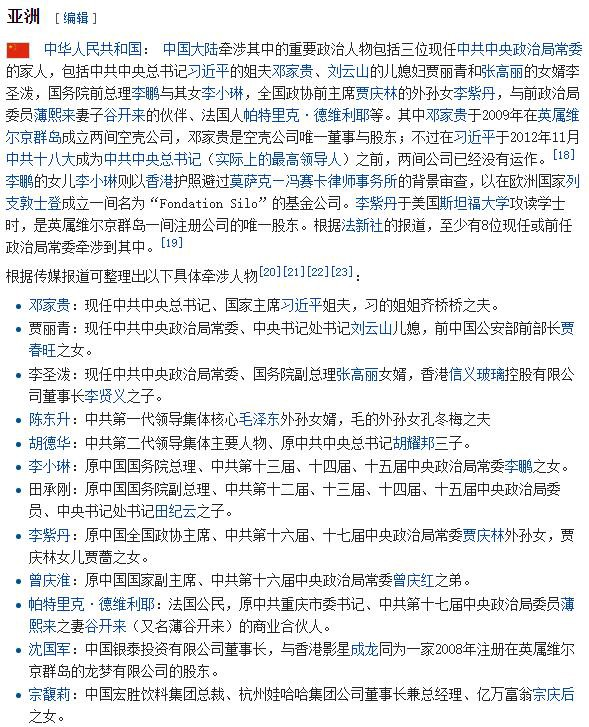

# 深度调查：为什么我们不能访问谷歌？

> 这篇三万多字的长文可能是互联网上关于谷歌撤出中国叙述最为详尽的一篇，它通过事件回顾、原因分析和未来展望，辅以诸多案例，全景式再现了谷歌事件的真实面貌，驳斥了所谓的“为人民屏蔽互联网”的谎言，指出既得利益集团以及政府高级官员假公济私才是谷歌和YouTube等世界知名网站被封锁的真正原因。本文亦穿插回顾了中国新闻出版和互联网管制的历史和现状，最后提出了四点建议，希望对中国互联网环境的正常化有所助益。（本文写作于2015年，次年定稿。作者：杨飞）

## 中国的互联网管制状况综述

先说个小事。我的外甥女每次从新加坡回中国度假都要抱怨上网难。我家是光纤到户，网速如飞，当然她抱怨的不是速度，而是很多网站不可访问，尤其是她做作业要用的谷歌Google以及联系同学用的脸书Facebook。

在中国大陆无法正常访问的网站很多，除了世界最大搜索引擎谷歌Google、世界最大社交平台脸书Facebook和推特Twitter，还有世界最大的财经网彭博社Bloomberg、世界最大视频网YouTube、世界最大图片分享平台Instagram、世界著名大报纽约时报New York Times，时断时续（部分屏蔽）的还有世界最大的百科全书维基百科Wikipedia、世界著名电台BBC中文网，以及英国《金融时报》、美国《华尔街日报》等等。据不完全统计，前后被中国政府屏蔽的网站在两千个以上，维基百科词条“中华人民共和国被封锁网站”就列出了数百个，涵盖政治、经济、文化、邮箱、图片、视频、云存储等等方面，涉及国际互联网几乎所有门类，而且主要是业内领先的大型网站。

上图：谷歌发表声明后，有网民在谷歌中国总部“非法献花”

很多海龟以及初到中国的外国人对此很抓瞎，这么多大型网站和手机app都不能用，来到中国就像来到了国际互联网的孤岛，立马与世界失去联系，无奈只得翻墙。翻墙是一件闹心的事，一是网速严重减慢，二是VPN等工具得时时更新，费力费钱。

抓瞎的不止老外，所有需要从被封网站获取信息的国人，包括教师、学生、记者、科研人员、外贸和金融从业人员等等，都被逼天天操练翻墙大法，工作和生活严重受阻。中国大陆对网络的封锁还在逐渐升级，2014年对谷歌邮箱Gmail的彻底封锁导致上千万中国账户无法收发邮件，用户一片哀嚎，尤其是外贸从业人员和申请读国外学校的孩子们。

还需要指出的是，虽然全中国有超过4亿人使用谷歌开发的安卓（Android）智能手机，但中国政府封锁了谷歌的手机应用商店Google Play，导致全国几亿智能手机用户无法安装官方认证软件，加剧了盗版软件和手机病毒的泛滥。凡此种种，不胜枚举。应该说，中国的网络封锁已经严重影响了国民生产和人民生活。

奇怪的是，我怎么也找不到这些网站被封锁的具体原因。以谷歌为例，被封锁了这么多年，既找不到法院判决书，也找不到行政执法通知书。中国政府发言人只是笼统地说这是“依法管理互联网”，但是网站具体违反了哪条法律，以及是如何危害国家安全的，一律无可奉告。无奈我只得自己找原因。被屏蔽的网站太多，让我们先从几个大的说起。

首先说Google谷歌，地球上最大的互联网公司，其搜索、视频、地图、邮箱等业务量均为世界第一，全球70%以上的智能手机使用谷歌开发的安卓操作系统。这是一头真正的网络大鳄。

## 大鳄翻脸

谷歌是2006年正式进入中国的，到2009年底，谷歌已经占据了中国互联网搜索流量的近三分之一，赚得盆满钵满。然而2010年1月12日，谷歌突然在官方博客发表声明， 名为“针对中国的新策略”A New Approach to China，称遭到黑客攻击（并暗指黑客来自中国政府），公司决定从即日起，不再按中国政府的要求对搜索结果进行审查。

上图：谷歌官方声明截图

声明原文翻译：“我们有证据表明攻击者的主要目标是入侵中国人权活动者的Gmail邮箱……这些未经报道的攻击和监视，以及过去几年来政府试图进一步限 制互联网上的言论自由已使我们得出结论，我们应重新审视在中国的业务运营。我们已决定将不再继续审查Google.cn上的搜索结果，并有可能关闭我们设 在中国的办公部门。”

以上文字相当醒目，这等于是公开与中国政府翻脸。在跨国公司历史上，甚至在世界历史上，一家商业公司以措辞严厉的声明与一个大国政府公开决裂，此种情形极为罕见。一个以赚钱为目标的互联网商业公司，居然要放弃地球上互联网发展最迅猛的地区，放弃一年几十亿的收入，这让各路财经评论家们眼镜掉了一地。

我刚听到这个新闻也是一头雾水。因为遭到黑客攻击，所以撤出中国？这是什么逻辑？黑客攻击乃是常事，各国政府、网络公司以及民间高手都精于此道，如果一遭到黑客攻击就撤，那谷歌早该死了多少回了。论技术实力，谷歌也不至于轻易输给黑客吧？

赶紧找来谷歌的官方声明仔细阅读，其中有这么几段：“我们对一些搜索结果受到审查而感到不适”，“我们将与中国政府就是否可以依法运营一个未经过滤的搜索引擎展开讨论”，但“中国政府在与我们讨论的过程中十分明确地表示，自我审查是一个不可谈判的法律要求。”

这些文字就很直白了，再结合双方的态度以及世界媒体的评论，不难发现黑客攻击只是个导火索，谷歌与中国政府翻脸的真正原因是：自2006年以来，谷歌和中国政府在搜索结果过滤（敏感词审查）这个问题上始终谈不拢。

## 我反对什么我就封什么

谷歌这边唱起了高调，但中国官方对网络封锁却按惯例保持沉默。尽管如此，还是有官员有意无意透露了谷歌事件的情况。原中宣部副秘书长兼全国宣传干部培训中心主任李伟2010年1月的一个讲话原文如下：

“同志们很关心这个（指Google声明将退出中国），我就我了解的情况，和大家谈谈。现在正在谈，双方在谈，那边（指Google）要求公开特殊字符限制，以及公开过滤机制；咱们这边要求它转移资料，要在北上广或其他城市架服务器，差距很大。其实呢，注定谈不成的。那边在挑战我们这里的网监体系，这是政策基点的问题，没有一丝可能性。我们这边的原则：一要表明态度，我反对什么，我就封什么，这是意识形态上的表态；二是要向老干部们表态，要表明我们没忘本，我们在维护声誉。这两点，在这个范围内，只能这样说，同志们可以自己进行理解。至于最后结果，人家必然要走，我们留不住，也没想留它。走一年，走两年，它总有求着回来的时候。这个把握，中央有，我们也要有。强调一下，这就是个法律问题，定性就是这样，不要擅自添加其他色彩。在公开舆论中，要注意口径，否则会被内部追责，请大家特别注意。再强调一遍，这就是个法律问题！”

上图：原中宣部副秘书长李伟同志及其简历

“特殊字符限制”听起来文绉绉的，其实就是敏感内容审查。对谷歌等搜索引擎来说，就是对某些词的搜索结果进行过滤。原中宣部副秘书长李伟的这段谈话相当雷人：**我反对什么，我就封什么**。这是典型的人治吧，哪里有一点依法治国的影子？

李秘书长口气这么大，当然是有原因的。众所周知，中国的传媒管理，最大的老板既不是法院也不是公安等政府部门，而是党的下属机构 — 中宣部，全称“中国共产党中央宣传部”，它掌握着全国最高话语权。所有的媒体，包括报纸、杂志、广播、电视、网站等等，无论线上线下，都必须听其指令，否则就请关门大吉。

谷歌对这种中国特色的网络管制当然是了解的，只是后来越来越不适应。后文我们将看到，中国政府的秘密互联网管制方式和谷歌“**不作恶**”的公司文化有相当严重的冲突。但谷歌那时既然决定了要在中国境内做生意，就必须服管。半推半就最后的情况就是：自2006年以来，谷歌虽然也执行中国官方的审查令，但执行得不够积极，时有漏网和过滤不及时。

中宣部对此相当恼火，又不便公开指责，于是通过中央电视台、人民日报等对其多次进行警告和敲打（包括使用一些莫须有的“下三滥”手段），谷歌中国因此陷入了各种“门”，如2006年2月的牌照门，2007年7月流氓软件门，2008年3月漏税门，2008年6月泄密门，2009年1月低俗门，2009年6月涉黄门等。

谷歌这种网络大鳄，店大欺客、野蛮并购、不顾用户反对随意撤并产品等龌蹉事干过不少，但要说谷歌是个涉黄流氓，老杨认为有点冤枉。在过滤黄色内容方面，谷歌还是比较努力的，比如谷歌的简体中文搜索（Google.cn）默认开启严格过滤，少有黄色图片漏网，而美国谷歌（Google.com）默认的是中等强度过滤。当然，如果需要，用户也可以自己选择严格过滤Strict filtering，就像这样的：

谷歌可能不是很明白，为啥我已经很严格了，但是中央电视台还是猛烈炮轰我为黄色流氓？同样的搜索机制，为啥在别的国家都没事？我想谷歌的高管可能没有很好地理解中国人的语言，比如敲山震虎、指桑骂槐等成语。

中央电视台说用谷歌搜索“儿子”，首页出现了母子乱伦的内容，于是证明谷歌是个涉黄流氓。这个逻辑其实并不完备。有极客论坛爆料，在央视新闻播出的前两周，谷歌服务器收到了大量包含“儿子”一词的搜索请求，用户随后专门点击不伦链接，而这些流量主要来自中国大陆。

按照谷歌搜索的算法，有效访问量占了很大比重，在突发大量“儿子”搜索点击黄色链接的情况下，黄色图片排名靠前是自然的。谷歌涉黄事件，其背后可能另有推手，不能排除栽赃的可能性。中央电视台的新闻逻辑有问题，但谷歌也没有就此翻脸。

涉黄门只是一个例子。总而言之，冰冻三尺非一日之寒，从2006到2009年，谷歌公司和中国政府多次交锋，积怨已久。所以，2009年12月遭到来自中国官方有组织、有目的、大规模的黑客攻击就成了压垮骆驼的最后一根稻草。在这堆稻草里，最扎人的就是搜索过滤这个根。

## 过滤与审查（中国为什么没有新闻法）

要探究互联网过滤的源头，我们得先回顾一下传统的出版审查，或称出版管制。简而言之，管制就是不让你看某些东西。这事古今中外的政府都在干。焚书坑儒告诉人们：总有些东西政府不让你看，如果你一定要看就砍掉你的头。

中国几千年来都是皇上说禁什么就禁什么，到了近代才慢慢走上法制轨道。中国第一个正式的出版法是1906年《大清印刷物专律》，后来还有1908年《大清报律》、1914年《出版法》、1937年《修正出版法》等。1949年新中国成立，随后颁布的《中华人民共和国宪法》确认了公民有言论和出版自由，但中国大陆至今没有专门的《出版法》和《新闻法》。这在世界各国中是非常罕见的。

为什么新中国成立六十多年也没有《新闻法》和《出版法》，不能连满清政府也不如吧？这主要是因为宪法已经明文规定了言论和出版自由，如果制定《新闻法》， 新闻和出版自由就是一个绕不过去的坎。任何法律都不能违宪。但如果《新闻法》确定新闻自由，那中宣部就无法命令各大媒体了。中共中央不会容许这种情况出现。

中国新闻立法推动人之一的孙旭培教授曾在《新闻立法之路》一文中引述了中国共产党老一辈革命家陈云的一句话：“在国民党统治时期，制定了一个《新闻法》，我们共产党人仔细研究它的字句，抓它的辫子，钻它的空子。现在我们当权，我看还是不要新闻法好，免得人家钻我们的空子。没有法，我们主动，想怎样控制就怎样控制。”陈云的谈话反映了中央高层一部分人对新闻立法的态度。

当然，也可以制定一个中国特色的《新闻法》，规定一切媒体听党指挥。理论上这么做没问题，但在全世界都推崇新闻自由、保障媒体监督的时候，中国推出这样一个反潮流的《新闻法》，在国际上岂不贻笑大方？人多少还是要点脸的。

我们都知道，新闻和出版法事关言论自由，是最重要的法律之一，在国际法律界素有“第二宪法”之称。但因为以上所述的原因，《新闻法》和《出版法》在中国难产了几十年，短期之内也看不到制定这两部法律的希望。中国政府陷入了两难，制定不是，不制定也不是，干脆就拖着吧。2016年3月10日，在第十二届全国 人大四次会议新闻发布会上，有记者问“新闻法立法有无具体的议程”，发言人干脆拒绝回答这个问题。

既然“第二宪法”没指望，那我们就回头来看看宪法，它明文规定了言论和出版自由（第三十五条 中华人民共和国公民有言论、出版、集会、结社、游行、示威的自由）。中宣部对媒体（包括个人微博）管得那么死，岂不是违反宪法？令计划下令全国媒体不准报导法拉利事件，岂不是也违反宪法？理论上确实如此，但中国的宪法基本只是摆看的，它不具备可诉性。

中国宪法明文规定了全国人大是宪法唯一的监督机构。全国人大有一堆委员会，教科文卫委、财经委等等，唯独没有最重要的宪法委员会。我们中国也没有宪法法院。所以，当出现违宪案件，比如中央禁止报导法拉利事件，如果哪位记者发飙了要起诉，他会发现无处可告，没有任何法院或机构受理违宪案件。我们既没有《新闻法》也没有《出版法》，加之《宪法》也被架空，所以新闻和出版自由在中国就只是一句空话。

虽然没有任何正式立法，但是出版相关的规章和通知却有好几十个。中国大陆的出版审查之严格，在世界上名列前茅。这里禁止私人出版和私人办报，印刷业属于严格监管的特种行业。每个出版社都有专职审查人员， 每年枪毙N多书稿。举个例子，鄙人曾出版过一本长篇小说《滇藏星空》，责任编辑都通过了，但还是过不了审查，最后我被迫删了好几千字才得以付印。

在一大堆出版规章中，国务院2001年颁布的《出版管理条例》是最重要的一个，但这个条例也都是些大框框，没有具体的审查标准。网上广泛流传着一个“出版审查100条”，业内人士都知道，但我没查到是那个部门颁布的，大家可以参考一下：

上图：出版审查100条明细第80–87条

鄙人观点，这些出版管理规章要认真追究起来其实都涉嫌违法 。中华人民共和国宪法第八十九条原文如下：“国务院行使下列职权：“根据宪法和法律，规定行政措施，制定行政法规，发布决定和命令。”这写得很清楚了，行政法规必须根据宪法和法律才能制定。现在我们没有新闻出版法，那这些行政法规能依据的就应该是宪法，而宪法第三十五条明文规定中华人民共和国公民有言论和出版的自由。

也许你要问，谈谷歌扯这么多印刷出版干啥？这是因为中国政府对传媒的管理政策是一样的，无论线上线下。绝大多数情况下，如果某资讯不允许实体印刷，政府也不会允许它在互联网上出现，反之亦然。

自1994年以来，互联网在很大程度上改变了出版和信息传播的方式。网络言论（出版）的自由度很大，论坛、博客以及手机app都是免费的，用户可以随时随地发布任何东西，信息量急剧增加，传播速度极快。这种新的信息传播方式，对出版和宣传管理构成了新的挑战。

先说明一下，政府对互联网的控制有很多种不同的叫法，互联网管制、互联网审查、互联网管理、互联网过滤等等，都大同小异，本文主要用“**互联网管制**”这个词。

总的来说，互联网管制有两种方式：内容管制和搜索管制。所谓内容管制，简单地说就是有些内容政府不想让大家看，旋即命令网站删除。这事说着容易，但在信息爆炸的时代，要滴水不漏地审查互联网所有的内容难度很大。本文草稿征求意见的时候，有人问为啥政府一定要和谷歌耗上呢，不就是个搜索工具吗？这话说得也没错，政府只要控制了互联网的内容，就不怕你搜，随便你用什么搜索引擎。但是全面内容控制的工作量太大了（后面我们有案例分析）。

相比内容控制的吃力不讨好，控制搜索引擎（实施关键词屏蔽和搜索结果过滤）可谓四两拨千斤，效率高多了。打个比方，某图书馆有一百万本书，其中有一万本政府不想让大家看，有两个方法可以做到这点，一是一本一本地下架，二是在图书馆的电脑索引中删除这些书目，让读者找不到这些书。你觉得哪种方法有效并且不授人以柄？

需要指出的是，政府对互联网的控制一般是双管齐下，内容管制和搜索管制同步进行。后文令计划与法拉利的故事就是典型的例子。

## 内外有别

上面讨论的都是本国网站，请问对外国网站要怎么办？这也很简单，既然管不了，那就屏蔽之。请注意，屏蔽只在中国境内有效，外国人照玩不误。听着有点像网络版“华人与狗不得入内”？

2014年10月30日，首届世界互联网大会在北京举行新闻发布会，有记者问为什么中国要关闭Facebook等国外网站，中宣部副部长鲁炜一语惊人： “我们没有关过境外的任何一家网站。你的网站在你家里，我怎么可能跑到你家去关你家的网站呢？”鲁炜其实说的并没错，任何国家都没有治外法权，中国政府对某些外国网站（以及服务器在外国的中国网站）无法关闭，只能屏蔽。

上图：鲁炜答记者问

需要说明的是，并不是只有中国在审查互联网，全世界很多国家和公司都在干这事，比如新加坡和美国等很多国家就屏蔽儿童色情网站，Facebook和Twitter就删除了大量涉及恐怖主义的内容。在某些伊斯兰国家，嘲讽先知穆罕默德的内容一律非法（但这些内容在法国等欧洲国家均为合法）。法轮功在中国大陆被定义为”邪教”，政府不允许它在互联网上存在，但它在别的国家和地区（包括香港和台湾）都是合法的，并且声势惊人。

有没有一些东西是全球公认应该禁止的？很遗憾目前并没有一个互联网全球管理准则。我个人认为，这个世界最重要的是生命，命都没了则一切无意义。这是普世第一原则。所以，凡是不利于人类生存的东西都应该群起而诛之。 有些东西堪称人类公敌，几乎所有的合法政府都欲除之而后快，这包括恐怖主义、种族歧视、儿童色情、制毒贩毒等等。谷歌在铲除这些内容方面和中国政府是一致的。2012年7月的时候，谷歌智库Google Ideas还主持召集了全球性会议，商讨如何在网络上铲除这些公认的犯罪行为。

不难理解，谷歌在全球都在执行某种程度的搜索和内容审查。我这里有一篇哈佛法学院的报告，Localized Google Search Result Exclusions，这份报告详细研究了113个网站在德国和法国被谷歌搜索部分屏蔽的情况，即同样的词汇，谷歌法国google.fr、谷歌德国 google.de的搜索结果与谷歌美国google.com的搜索结果不一样。这个报告指出，在德国和法国移除的搜索结果大多是白人民族主义 （White nationalism）、反犹太主义、纳粹主义以及伊斯兰教激进派网站，因为这些内容违反了所在国的法律。这个案例还说明，谷歌（根据当地的法律）在欧洲施行了比美国更严格的搜索审查。

政府审查在地球上普遍存在，谷歌自己也有内部审查。双方都审查，为啥谷歌和中国政府就谈不拢呢？一般认为，他们的冲突主要在于两点：第一，审查的内容有冲突，即某些内容中国政府要管制而谷歌认为不妥；第二，审查的方式冲突，中国政府的互联网管制多为秘密通知，而谷歌倾向于公开和透明化。本文将重点探讨这两点。

## 分歧何在：审查的内容

先来谈审查的内容。这个问题看似简单，但要找确切的答案却难似登天。中国官方没有任何资料可查，各级政府对网络审查的具体内容连一星半点说明都没有（除了依法管理之类的几句空话和大话）。奇怪的是，谷歌虽然不惜公开翻脸，但它也不把话说具体，它并不公布哪些审查令它无法接受，也从不举例说明是哪些敏感词引起了争执。

不但谷歌，我在网上挖地三尺也同样很难找到其他互联网公司进行审查的具体情况，比如哪些词汇要过滤、哪些文章要删除以及哪些网站要屏蔽。我百思不得其解，这么重要的事情，难道靠口头通知？但事实基本就是如此。我在网上找到了一篇文章， 《中共钳制媒体揭秘 — 从公开到隐蔽，由宏观及微观》，作者是《南方都市报》前总编程益中。这篇文章发表在《新政治家》杂志2012年10月号，部分摘抄如下：

“2001年5月的一天下午，我接到一个声称来自中共广东省委宣传部的陌生电话，要我撤掉《南方都市报》将于第二天见报的一篇稿件。作为南方都市报总编辑，我经常接到中共各机关类似的电话。不过这次来电者我不熟悉，而我也想借机表达不满，就很不客气地答复：‘不好意思，我不认识你，不能确定这就是来自部领导的指示。为防止有人冒充宣传部领导对报纸发号施令，麻烦你传真书面文件给本报，否则无凭无据难以执行’。

“江泽民统治的后期，丁关根领导的中共宣传部门对媒体的控制越来越严。一个显著的变化是，宣传部门不再像以往那样郑重其事地下发文件或明传电报， 对媒体发号施令，要求总编辑执行，而主要采取电话口头传达或手机短信通知的方式，直接指令总编辑或具体负责人。原因在于禁令越来越多、越来越频繁，书面行文需要层层报批，过于繁琐，也来不及应付紧急状况。而电话口头传达和手机短信通知，手续简化，效率高、见效快。

“应该是对自身行动的不正义性和制度性犯罪的事实心知肚明，中共的媒体控制在胡锦涛时代开始进入地下秘密状态。这一时期的显著变化是：打电话给媒体传达禁令的宣传部门官员，通常都会在挂机之前强调：‘不得做书面记录，不得留任何字据，不得透露下达了什么禁令，不得透露是什么部门下达的禁令，更不得透露下达禁令领导的姓名……’中共宣传部的禁令，就这样在秘而不宣中得以贯彻执行。”

读到这里诸位应该明白了为什么谷歌撤出中国的调子唱得很高，但却不把话说具体，因为谷歌手上可能并没有多少书面字据。电话录音或记录有吗？这个我不好确定，得问谷歌公司有关人士。

虽然谷歌和中国政府双方都在打哑谜，但我们还是有办法推断他们到底在吵什么（哪些互联网内容被管制了）。总体来说有以下三种方法，一是维基百科法，二是“消息灵通人士”法，三是比较法。下面我们逐一来看。

### A.维基百科法

维基百科Wikipedia号称地球最大知识库。假如一个问题在维基百科都找不到蛛丝马迹，那它的答案在地球上也基本上无处可寻了。所以，想知道中国有哪些管制内容，有哪些敏感词，第一个方法就是去维基找答案。

维基百科词条“中华人民共和国的网络审查词汇”列出了一大堆敏感词，从单字到组合词，比如：胡、刘、李、吴、温、习、贺、贾、令、计划、法拉利、胡锦、 hujin、月月鸟、泽民、太上皇、蛤蟆、康师傅、27亿、真理部、纽约时报、阿波罗新闻、红太阳的陨落等等。

上面这些词是截止2013年初的。应该指出的是，敏感词经常在变化，每个省区的敏感词也可能不一样，并且有时候昨天的敏感词今天就不再敏感，比如令、计划+法拉利、（周永）康师傅等等，现在都可以自由搜索。

敏感词汇表是中国政府和谷歌搜索的主要分歧之一。虽然中国政府从不公布这个词汇表，但敏感词的存在是不争的事实，它存在于我们每天的日常生活中。在论坛灌水，在博客发文，常会遭遇“内容包含不当或违法词汇，请返回修改”诸如此类的提示，但具体哪些词有问题，对不起无可奉告。这让网民们很抓狂，所以有人专门开发了敏感词检测软件，比如“百度贴吧和谐测试器”等等。这类软件是中国独特的互联网审查环境下的奇葩之一。

上图：防和谐软件截图，该软件收录敏感词9378个

中国大陆互联网过滤的内容之多，敏感词变化之莫名，让网民无所适从。比如某段时间不可搜索胡+温，这勉强可以理解，但某些带“胡”的词在谷歌都不准搜索， 比如说胡萝卜，就让人抓瞎了。很多人对此颇有微词。虽然我对作家韩寒并不感冒，但他2010年5月有篇博客曾被广为传播，这里引用一下：

“事实上，我一点都不怀念谷歌。谷歌就像一个姑娘，有一天她跑过来说，我要离开你。我说，不要这样亲爱的。让人伤心的是，最后她还是离开了。但是我发现， 其实当我想上她的时候，我还是随时能上她。唯一的不同就是以前我上她的时候能从她身上搜出胡萝卜，但是现在，我问她，胡萝卜呢，她就嗖一下不见了。”

外国人看这段可能不知所云。要理解这种文字，得对中国大陆“宁可错杀三千，不可放过一个”的网络审查环境有深刻理解才行。

用维基百科查敏感词要补充一点，维基百科本身在中国大陆也遭到屏蔽，访问时断时续，若想畅通无阻请适时爬墙（目前已彻底屏蔽）。2013年8月，维基百科联合创始人威尔斯对记者表示，他宁愿放弃在中国开展业务，也不愿接受中国方面任何形式的互联网审查。这和谷歌的做法如出一辙。看来维基百科被彻底屏蔽也是迟早的事。

保持好奇，获取知识，此乃人类本性。因为有几个词条的解释与政府的不一致，所以要阻止民众访问全球最大的知识库，这种做法堪称反人类。因为饭里有几粒沙子，从此以后就不吃饭，还不准全国人民吃，此逻辑令人惊诧。

### 消息灵通人士法

这是指内部人士有意无意走漏了风声。本文开头引述的中宣部李伟的谈话就是一例，他透露了谷歌和中国政府谈判的情况。网络审查和敏感词也是一样，虽然官方三缄其口，但免不了有知情人士透了口风。

我查到的资料里有一个名叫张贾龙的博客作者，他是前腾讯财经频道的小编，后来被开除，原因是“泄露商业秘密等保密敏感信息”。张贾龙透露的管制内容有“习特勒”、“讲话精神研究中心”、“谁让我们成了无产阶级”等等。

我试了一下，张贾龙透露的信息基本准确，谷歌搜索“习特勒”有一万多条结果，而百度则基本无法搜索这个词（除了几张希特勒相关的照片）。

上图：2015年10月5日百度搜索习特勒的结果

以下是同时用谷歌搜索的结果：

### 比较法

上面这两张图也基本说明了什么是比较法：现在的谷歌不受中国政府管制，假若你怀疑哪个词是敏感词，就用谷歌和百度对比一下，如果搜索结果大相径庭，这个词十有八九被审查了。

如果说“习特勒”这种词有欺君犯上之嫌，应该屏蔽的话，有些词被审查则让人莫名其妙。举个例子，“章贡区网宣办”，以下是谷歌搜索的结果：

上图：2015年9月7日谷歌搜索“章贡区网宣办”

江西小城赣州的一个区的一个办公室，居然有超过30万条搜索结果，一个小小办公室也能这么火？原来是这样，2014年12月，一名黑客破解了赣州市章贡区网宣办的工作邮箱，将整个信箱内容公布在网盘上。此文件很大，诸位可以自己下载慢慢读，体会基层宣传工作者的艰辛。在网络时代，宣传管理工作比传统印刷时代要艰苦多了，信息量巨大，传播速度极快，经常需要加班，24小时待命。

作为对比，下面我们用百度来搜这个词：

上图：2015年9月7日百度搜索“章贡区网宣办”

同样是搜索“章贡区网宣办”，百度只有3,040条结果，是谷歌的1%不到。百度再怎么烂，搜索数量差这么多是不可思议的。再来看其首页，内容也与谷歌完全不同。这里面有搜索引擎内部机制的原因，比如百度著名的竞价排名（交钱多的排首页）。另外一个原因大家都能猜个八九不离十：这个词在中国遭到了审查，百度按照官方要求过滤了搜索结果。

章贡是个小地方，但只要是在中国，地方无论大小，管制无所不在。比如天安门这个无人不知的大地方，百度和谷歌搜索的首页分别如下：

上图：2015年7月20日百度搜索“天安门”的首页

作为对比，下面是同一时间谷歌搜索的结果：

用百度和谷歌分别搜索“天安门”，首页的结果完全不同，而且谷歌排前三名的网页在百度里根本就找不到。很显然“天安门”这个词在百度被审查了，某些网址被屏蔽。

看到这里大家应该很清楚为什么谷歌在中国得关门，那个3小时纪录片《六四天安门》是官方禁片，谷歌不遵守官方禁令，岂能容你？顺便说下，这个3小时纪录片（以及类似的涉及中国政治的视频）也是全球最大视频网YouTube被禁止访问的主要原因之一。

当然，比较法最好是直接比较谷歌搜索（在管制和无管制状态下）的结果。以下是我在网上找到的一个例子：

上面这两张是中文谷歌和英文谷歌的图片搜索结果对比，可以看出“天安门”这个词在中国确实是被严格管制的。英文搜索的结果表明了谷歌公司的态度：这个词不应该被管制，而谷歌的简体中文搜索那时候只得遵从中国政府的命令。

## 真理部的指示

通过维基百科法、比较法和“消息灵通人士法”，我们大致知道了中国的互联网管制情况。但这都是间接分析。有没有来自官方的互联网管制具体资料？这个难度确实有点大，据说这些都是国家机密。不过，通过维基解密我还是找到了一份相关资料 。

下图是维基解密发布的一份某省网宣办文件（请注意，网宣办不是政府机构，而是党的机构）。这份文件列举了互联网上哪些舆论要引导，如何引导，规定得非常细致，有删除、推荐、置顶、沉帖、压至后台以及请网评员出马等等，时限规定清楚，责任落实到人。这份文件超长，有时间的读者可搜关键词“真理部指示2008 年4月-8月”，自行阅读。

上图：“真理部指示2008年4月-8月” 部分截图

维基解密的资料是否真实，这里不做评论。我个人观点，这样一个超长表格，内容又如此细致，造假难度很大。这个表格也让我们看到了互联网内容控制工作之细致。这和奥威尔的小说《1984》描绘的场景很相似。它告诉我们：不要轻易相信你的眼睛，因为你能看到什么，都是由一位“老大哥”决定的。在互联网时代也是一样，博客、论坛、门户网站新闻等等，尽在“老大哥”掌控之下。

最后举个例子。汶川地震给中国人民留下了深刻印象。在这次死伤惨烈的地震中，各路记者冲锋陷阵，给人的印象是媒体都放开了报导，但根据维基解密透露的这份文件，汶川地震期间的互联网管制也同样严格，继续截图看下：

这表格看得头晕眼花？也许有人要问：这是内容管制吧？这篇文章谈的是谷歌搜索，对于搜索管制，有没有类似的汇总表格？很遗憾维基解密没有这方面的资料。不过，根据内容管制来推导搜索管制的大致情况并不难。如果某个内容被删除，相关词汇的搜索也常常会被过滤，这两者通常是同时进行的。 请参见后文《炎黄春秋》停刊的案例。

到这里我们可以大致总结一下中国政府互联网管制的最大特点，那就是不允许出现与官方不一致的观点。这并非我的个人随口胡掐，二十年来中国政府一直就是这么做的，官方很早以前就这么说过。前中共中央总书记江泽民在2000年8月接受美国CBS记者迈克•华莱士专访时曾有如下对话：

华莱士：“主席先生，你为什么封锁网站，包括BBC和《华盛顿邮报》网站，理由何在？你不信任人民从网上取得信息及学习吗？”

江泽民：“我希望人们从网上学习很多有用的事情，但无论如何，网上有时也有不健康的东西，特别是网上的色情内容，对我们的年轻人伤害很大。”

华莱士：“BBC和《华盛顿邮报》网站没有色情的东西。”

江泽民：“它们被禁可能是因为有些政治消息的报导，我们需要有所选择，我们希望尽可能地限制对中国发展无用的信息。”

上图：江泽民和华莱士北戴河访谈

根据我查到的资料，这是中国最高领导人首次就网络审查公开表态。“限制对中国发展无用的信息”这个表述很抽象，实际情况是，哪些信息对中国的发展无用其实全凭上头一句话。后面的案例我们将看到中国的网络管制基本都是人治，和法制很难挂上边。原中宣部副秘书长李伟的那句话“我反对什么我就封什么”，这和江总书记其实是一个意思，只是李伟说得更直接一些。

## 网络屏蔽案例分析

这篇文章之所以不遗余力讲案例，乃是因为如果事情不说具体，我们就无从辨别中国网络审查的正当性与合法性，也就无法对谷歌和中国政府的争执给予基本的判断。

总的来说，从江泽民、胡锦涛到今天的习近平时代，中国政府对互联网的管制越来越严厉，没有一点放松的迹象。前面的《六四天安门》纪录片就是一例， 只要这个片子还出现在YouTube里面，YouTube在中国大陆就别想正常访问。同理也适用于Facebook和Twitter，只要中国政府不满的内容在上面传播，这些社交网站就别想在中国运行。

让我们来看最近的几个案例。2014年10月21日，中国政府突然封杀了方舟子的博客、微博和微信公众号，一夜之间方舟子就从中国大陆的互联网上消失 了。中国政府这次封杀方舟子，和以前封杀清华大学社会学教授郭于华、北京大学宪法学教授张千帆等人的手法一样，既不通知也不审判，而是偷偷干掉，全国整齐划一，行动非常迅速。

方舟子突然被屏蔽，原因大家都知道，就是因为他批评了一个名叫周小平的“网络作家”。周小平先写了一篇文章《梦碎美利坚》，列举了美国的种种不是。这篇文章有诸多硬伤，有些证据纯属捏造。曾在美国读博的方舟子看不下去了，于是专门撰写了一篇长文《“网络作家”梦游美利坚》，指出周小平的诸多错误。

文人之间的论战我们见得多了，为什么这次国家机器要参与其中呢？其原因就在方舟子被封杀的前几天，2014年10月15日，国家主席习近平在北京主持召开文艺工作座谈会，邀请了72位文艺界名人参加，周小平和花千芳作为网络作家的代表参加了座谈。座谈会结束时，习主席还走到他们面前亲切地说：“希望你们创作更多具有正能量的作品。”

上图：网络作家周小平和花千芳（举手者）

周小平是中国官方树立的网络文艺典范。方舟子不知好歹，撰文批评官方作家，结果立马被缝嘴。这次还不是简单删帖，而是全面销号。除了抓人，这应该是最严厉的互联网内容管理手段了。

方舟子被彻底屏蔽，说明了中国政府互联网管理的一大特点，那就是发表文章可以，但是观点不得与官方有异，更不得广泛传播。用宣传部门的语言，那就是全国上下都必须“与党中央保持高度一致”，否则搞你没商量。

最新的案例还有纪录片《穹顶之下》。这几年中国雾霾围城， 民众颇有怨言。2015年2月28日，有个叫柴静的小妹上传了一个她自己拍的纪录片《穹顶之下》，讲述她本人对雾霾的看法。这个片子创下了全国纪录，一周之内点击播放超过一亿次，然后就没有然后了。从2015年3月7日晚上开始，全国所有的视频网站统一下架了《穹顶之下》，现在中国人要看这个片子只能翻墙去国外网站。

和往常一样，中国政府对此保持沉默。我个人估计，《穹顶之下》提起了公众对雾霾的重视，这本是一件好事，但该片被广泛传播之后，公众自然会追究雾霾围城的原因，其中之一就是政府管理不力。中国政府最怕自己被广泛质疑，因为这有可能动摇其执政的基础。《穹顶之下》被封杀还说明了一件事： 对这个政府来说，人民的生命和健康并不是最重要的事。

当然，也不是说在中国大陆就不允许批评政府。在饭桌上私下侃侃可以，在公众场合就要注意了，借助网络广泛传播更是被严格禁止，相关言论会立马被掐断和查封，相关人士会遭到各种处理和封杀。近期案例请搜关键词“毕福剑”以及“德国雷克”。

有一点要说明，无论互联网怎么严格监管，还是能搜到一些批评政府的言论，有的尺度还相当大。原因之一是因为互联网的内容浩如烟海，纵有成百上千亿的维稳资金也不可能每一页都人工审查，只能挑重要的来，先管好门户网站、大型论坛和主流社交工具，比如博客、微博和微信。单就微博来说，重点管好那些上万粉丝的大V即可， 至于那些没几个粉丝的普通账号，随便他们发表什么言论好了，起不了什么风波。这就是为什么有时你在微博小户上（以及互联网上）能找到一些尖锐的言论，但是在大V微博里却找不到。

小账户和微博大V的社会影响力完全不是一个档次的。有些文章在微博小号上存在得好好的，一经大V转发就立马被屏蔽。举个例子，鄙人的文章《和大学生朋友们谈谈我对毛主席的个人看法》在我的微博上几年都没事。2015年1月11日，拥有三千万粉丝的任志强将此文转到他微博上，不到两小时就有三千多次转发，然后立马被屏蔽。

当然，这并不是说中国政府对平头百姓的言论就完全放任自流。我本人的其他文章也经常被屏蔽，《蛋炒饭与白眼狼-老杨再谈朝鲜战争》、《老杨再谈徐纯合之死》等等，这些文章无论是在微博还是微信都发不出去。有时换掉某些敏感词发出去了，第二天人工审核照例删除。这些文章都是鄙人原创，既不涉毒也不涉黄，一句骂人的话也没有，被删的原因只有一个，那就是鄙人的观点与官方有异。

对谷歌来说，互联网内容和搜索的双重审查要和中国政府保持100%一致确实勉为其难。《谷歌透明度报告》有一句话，说明了为啥谷歌对政府的屏蔽要求有时不予执行：“……某些要求可能不够明确，我们会要求提供更多信息……有时我们不遵从相关要求是因为这些要求不是通过适当渠道提出的。要求必须以书面形式提出，不能是口头说明。有时政府机构提供的书面信函效力不足，必须另行申请法院命令。”

谷歌这种死脑筋，凡事都要搞得那么正规，删除的要求必须是书面通知，不行还得走法律程序，这和中国政府的做事方式完全对不上号。后文的案例我们将会看到， 令计划的儿子开法拉利玩双飞死了，官方第二天就禁止搜索法拉利系列词汇，没有哪个法院有如此高效的判决，这只能紧急电话通知。诸如此类的例子还有不少。谷歌在中国水土不服，与中国政府冲突不断，最后彻底翻脸。

## 分歧何在：审查的方式

为什么谷歌死在中国，上面我们讨论了第一点原因，审查的内容有分歧。但还有一点更重要：审查的方式有分歧。中国政府的互联网审查多是秘密进行，而谷歌倾向于公开和透明。

上图：外交部发言人洪磊答记者问

2014年10月，有记者问为什么英国广播公司BBC网站被屏蔽？外交部新闻发言人洪磊按惯例答道：中国政府依法对互联网进行管理。虽然“依法管理”这个词时常被中国政府官员挂在嘴边，但实际情况是，无论是屏蔽网站还是划定敏感词亦或删除文章，没有一例是依据法庭的判决，更无一例依据了某条具体的法律条文。

就我所查阅的资料，互联网审查在世界多数国家是一个法律问题，删除或屏蔽在欧美多以法院的判决为准，而中国大陆的互联网审查从来没有法院什么事，它们是各级政府和党委自行决定，以上级指示甚至口头通知的形式下达，黑箱操作，不予解释。

这就是中国网络审查方式的最大特点：秘密审查，秘密执行。公众无从知晓审查的程序和依据，官方也从不发布任何公告。小的案例就不说了，就谷歌系列产品来说，上亿人在使用谷歌的商店、搜索、地图和各种服务，屏蔽谷歌这么大的事，即便不审判也不新闻联播，起码也该在报上登个启事吧？中国政府偷偷干掉谷歌，此种行为就好像半夜把桥炸了却不在桥头立个牌子，相当缺德。

中国的敏感词过滤，其官方说法是“特殊字符限制”，民间则有各种说辞。以微软的Bing为例，它的搜索页面最下方有时候会出现一行小字：“为回应符合本地法律要求的通知，部分搜索结果未予显示。”这一行小字就是微软的Bing搜索（以及百度、搜狗、好搜和以前的谷歌在内的所有在中国做生意的搜索引擎）活下来的秘诀。我很想看看这些通知的实例，但是挖遍互联网也没找到一个。它们全都是国家机密？

上图：Bing搜索的最后一行小字
 
微软公司对这行字是这么解释的：“如果政府机构要求删除显示的搜索结果与我们联系，我们需要政府机构提供适用法律和权利的证明，以及官方的删除要求申请……那么我们可以履行删除申请。如果要求我们必须实施申请，我们将有限地实施。”

微软说得很委婉，“有限地实施申请”？哪位能举个例子说说它什么时候拒绝了中国政府的删除要求？微软Bing搜索拒绝了中国政府的屏蔽要求，还依然能在中国运行，难道中国政府对谷歌和微软执行了不同的标准？

## 秘密法律

请注意“为回应符合本地法律要求的通知”这句话，乍听起来这些“通知”都是法律的产物。但必须提醒一下，法律有一个重要特征：必须公开。

公开性是法律的天然属性，它有两个含义，一是法律条文不得保密（这是废话），第二，法律程序应该公开。即便少数时候可以秘密审判，但任何情况下都不得秘密宣判（ 以及秘密执行）。

如果按照官方的说法，互联网屏蔽和敏感词过滤是依法管理，则那些“通知”可以看作是简易审判之后的判决书，但是它们却从来没有公开过。

联合国《公民权利和政治权利国际公约》规定，“因道德、公共秩序或国家安全的理由，可不使记者和公众出席全部或部分审判，但任何判决都应公开宣布。”这也符合中国的刑事诉讼法的规定：对于不公开开庭审理的案件，应当当庭公布不公开的理由。所有的案件，不论是否公开审判，判决一律公开宣告。

我们可以想象一下，如果秘密审判，还加上秘密执行，那街头就会有人突然消失，人间蒸发，且原因不明，这个国家就会变成一个人人自危的恐怖国家。所以，虽然某些涉及机密的案件可以秘密审判，如周永康案，还有军事法庭负责的谷俊山案等等，但审判的结果都必须公开。

根据以上分析，我们可以得出这样一个逻辑三段论：

（1）凡是符合法律的，其判决和执行必定公开；反言之，凡是秘密判决和执行的，必定不符合法律。

（2）中国互联网审查从不公开，等同于秘密判决并秘密执行；

（3）所以，中国的互联网审查不符合法律要求。

由此可见，外交部新闻发言人宣称的“依法管理互联网”其实是一句谎言。现在中国互联网管理的情况是：大多数被审查的网页和网站都是莫名其妙突然消失，没有审判，没有公告，不符合法律程序的基本特征。这就是为什么外交部新闻发言人只能用“依法管理”这样的大话来搪塞，他们从不告诉你被屏蔽的网站具体违反了哪一条法律，也不告诉你下达通知的具体是哪个机构。中国的很多事都是如此，官方不敢说具体，一说具体全是违法的，但是官方偏偏都打着“依法治国”的幌子。

这样的例子太多了。比如2016年2月26日，国家网信办发布公告，依法关闭一堆微博，包括@演员孙海英、@王亚军上海、@荣剑2001、@文山娃、@纪昀、@罗亚蒙、@大鹏看天下等大V账号。

我看到报导顿时愣住了，这公告原文是这么写的：“……少数网络名人无视社会责任，滥用自身影响力，在网上多次发布反对宪法所确定的基本原则、损害国家荣誉和利益……”网信办判定公民违宪？这真是一个雷人的公告，因为《中华人民共和国》宪法第六十七条明文规定了由全国人大负责解释宪法并监督宪法的实施。除全国人大（及其常务委员会）之外，任何人或机构都无权解释违宪事件。网信办判决公民违宪，我真是被雷到了。谁才是真正的违宪？宪法是一个国家的根本大法，必须严肃对待。在今天的地球上，由国务院（行政院）下属的一个办公室来判决和公告违宪案件，除了中国恐怕别无二家。

话说回来，这次网信办敢于站出来公告，这本身是一个进步。在大多数情况下，他们的行动都是秘而不宣的，与暗杀类似。

## 审查与暗杀

关于与暗杀类似的中国互联网秘密审查，我在这里补充一个最新案例。这是我本人的亲身经历。

2016年7月18日晚我发了一条微博，没有一个字，只是分享一张图片，然而此微博半小时之后就被管理员禁止转发（随后被删）。接着我就被禁言，无法发布、回帖和互粉。 到7月20日晚，我的微博依然无法使用，于是我发了一条微信朋友圈，全文如下：

“各位朋友，我的微博已被禁言，不能发布、回复和互粉。新浪称我违反了微博社区规则。鄙人正在和新浪小秘书交涉，争取早日恢复正常。我仔细翻看，可能是因为一张图片。这张图是我发的最后一条微博。此图如此敏感，出乎我的意料”。

这条朋友圈并附上了这张图片。奇怪的是，发出两个小时之后，没有一个赞也没有任何留言。经过和几位微信好友截图沟通，确认我这条朋友圈已被管理员屏蔽，只有我自己能看到，朋友们都看不到。

经过朋友们的反复验证，我们最后确认：不论是微信还是微博，只要内容包含有这张图片，或者包含有“炎黄春秋停刊”这几个字，均会被屏蔽或删除。

也许你要问，什么图片这么敏感，遭至这么严厉的封杀？其实也没啥，就是下面这张，《炎黄春秋》停刊声明：

对“炎黄春秋”事件的消息管制我感觉是空前绝后的严厉（可能不会绝后吧）。著名杂志被迫停刊，同行理应唇亡齿寒，但中国所有的媒体都对此事保持沉默，没有任何报导。微博和微信等个人社交工具也被严格审查，连图片识别技术都用上了，发布消息者一律屏蔽、销号或禁言。除了抓人，这应该是最严厉的互联网内容管控手段了。

意料之中的，针对《炎黄春秋》停刊事件，中国政府也对搜索引擎进行了严格管制。截图举例：

上图：2016年7月21日谷歌搜索“炎黄春秋停刊”

谷歌搜索有129,000条结果。不难看到，虽然国内鸦雀无声，但《炎黄春秋》停刊事件在海外中文媒体上炸了锅。

上图：2016年7月21日百度搜索“炎黄春秋停刊”

相比谷歌的十几万条结果，百度搜索总共只有18个结果，而且没有一个和该杂志停刊有关系。由此可见，为了集团的利益，中宣部开足了马力，在内容管制方面连个人通讯工具都不放过，搜索引擎也被彻底管死。

某杂志停刊发一个公告，并不是什么大事，为什么政府如临大敌呢？鄙人愚见，原因有二。一是《炎黄春秋》这本杂志有点特殊。创刊25年以来，这本杂志一直被视为中国共产党内部改革派最重要的理论阵地，订户近二十万，有全国性影响。该刊曾发文深挖中共历史上的错误，也曾连续发文肯定前总理赵紫阳的贡献。该杂志的前副社长杨继绳还出版有《墓碑》一书，对1959–1961年饿死三千万人的事件进行了详细报道和深入论证（这本书2008年在香港出版，随即被大陆官方列为禁书）。2015年，杨继绳还发表了一封《致国家新闻出版广电总局的公开信》，公开挑战政府的图书和期刊出版管理“十五条”。可以这么说，《炎黄春秋》这个摊子对当权派来说如鲠在喉，必需除之而后快。

《炎黄春秋》当然也不是吃干饭的，它的法人代表杜导正是全国人大代表、前《光明日报》总编，并曾任新闻出版署署长。老一辈革命家习仲勋曾经给炎黄春秋题有八个大字：“炎黄春秋，办得不错”。虽然如此，这本杂志还是被迫停刊了。由此看来，在激烈的党内路线斗争之后，保守派已经全面获胜。他们并可借此警告全国媒体：若敢再不听指挥，胡言乱语，尚方宝剑也保不了你。

上图：习仲勋题词：炎黄春秋，办得不错

第二，杂志突然宣布被迫停刊，这种方式相当惨烈。海外媒体对此的评论是：宁为玉碎，不为瓦全。对于政府最后采取强行进入的流氓手段，亦有媒体形容为“图穷匕见”。《炎黄春秋》是7月17日宣布停刊的，7月19日，杜导正接受海外媒体电话采访时说：“我抗议，我愤怒……作为一个老干部、老共产党员，实在觉得没有办法理喻。这么像文化大革命的搞法，难道我们共产党又开始搞文化大革命了吗？”

杜导正说，“1966年文化大革命时，我正在办公室里就来了造反派，宣布你是走资派，你是反革命，你的权已经被我们夺了，请你离开这个地方……整个报社被他们占领了。这次给我的感觉有点那个味道。”

鄙人观点，杜导正接受采访说话还是很克制的。按文化大革命那搞法，人家红卫兵占领报社，那是明火执仗。这次《炎黄春秋》杂志社被强行占领，随后严格封锁消息，性质当属暗杀。所谓暗杀，就是说我干掉你，但我不让人知道。 使用暗杀手段，本身就说明了他们的行动是非法的，见不得人。

暗杀作为一种非正常手段，不到万不得已谁也不会出此下策。原因很简单，一旦败露，可能满盘皆输。古今中外这种案例很多。近的来说，1946年7月闻一多被国民党特务暗杀，没多久国民党在大陆就树倒猢狲散，教训实属深刻。这次《炎黄春秋》之死，它所传递的信息是：与官方不一致的观点不得广泛传播，无论是互联网出版还是印刷出版。

## 意大利汽车和巴拿马香蕉

2014年10月30日，在国务院的新闻发布会上，朝日电视台记者问：西方一些网站比如说Facebook在中国无法访问，请问中国为什么要关闭这些网站？中宣部副部长鲁炜回答说：“我没有用过这些网站，我不知道是不是被关闭，但是我想这样的情况肯定是存在的。我想要说明的是，我们的管理都是按照中国的法律进行，我们的一切措施都是为了维护中国的互联网安全和中国消费者的权益。”

鲁玮的调子唱得很高，但后文的案例诸位将会明白，中国政府强力屏蔽国外著名网站，主要目的在于维护小集团和“老干部”们的利益，而国家声誉以及人民的利益，以及屏蔽的手段是否合法，他们根本不顾。

中国的互联网屏蔽，有时候是某个“老干部”当天出事，马上就屏蔽，十万火急，立即执行。学法律的同学都知道，任何事若要走法律程序，其过程是冗长的，审判和上诉长达几个月是常事。这也决定了中国的互联网屏蔽不太可能走法律程序。本文附件有篇文章，《审查机器，了解一个真实的中国互联网》，里面叙述了作者作为网站负责人的时候，半夜接到河北省新闻办的电话，要求立即删除某网页。这种夜半鸡叫似的口头通知紧急行动，我的不少网管朋友都有类似经历。此类行动经常发生，比较著名的一次是2012年3月的法拉利事件。

意大利出产一种很贵的汽车名叫法拉利，它动不动就是四五百万元一辆，这注定了它只是富人的玩具，穷人只能看图意淫。2012年3月19日，很多中国网友突然发现无法搜索“法拉利”相关词汇。大家都很诧异。直到前国家领导人之一的令计划落马，大家才明白出了什么事。

2012年3月18日凌晨4点，北京市北四环保福寺桥发生了一起车毁人亡的重大事故，一辆黑色法拉利跑车猛撞围墙，驾驶员当场身亡，车身基本解体并甩出了两个“衣衫不整”的女子，一死一重伤。一个半裸，一个全裸。

天价名车，死伤惨烈，一男二女，还衣衫不整，这当然是新闻的好材料。第二天《北京晚报》、《新京报》等多家媒体都有报导，网络和社交媒体上也开始疯传，车上那两个女生是中央民族大学的，其中一个还是活佛的女儿。然而到了第二天晚上这一切戛然而止，网络上有关此次事故的帖子全被删除，网站的新闻报道被撤稿，百度搜索屏蔽了“法拉利事件”，新浪微博也同时屏蔽了“法拉利”和“中央民族大学”等多个关键词。这就是典型的内容管制和搜索管制同时进行。

上图：黑色法拉利车毁人亡现场

两年多之后，2014年12月，随着全国政协副主席、中共中央办公厅前主任令计划被隔离审查，法拉利事件又重新可以搜索了。现在大家都知道，那辆黑色法拉利的驾驶员是令计划的儿子令谷。

24岁的令谷是北京大学在读研究生，他这辆价值超过五百万元的法拉利跑车从何而来呢？这事要追溯开来，令计划当然会受牵连。所以，令计划在车祸当晚即动用了中央警卫局封锁事故现场，第二天又利用职权禁止媒体报导，并指示有关部门对互联网进行全面屏蔽，包括“法拉利”在内的诸多词汇立即变成了敏感词。

党的高级干部一个电话就能号令全国媒体和互联网，禁止访问和搜索，这难道就是外交部发言人声称的“依法管理互联网”？这难道就是中宣部副部长鲁炜所说的“维护中国的互联网安全和中国消费者的权益”？

下面我们再来看一个案例。2016年4月6日，有中国网友又惊讶地发现，巴拿马系列词汇突然无法搜索。巴拿马是个弹丸小国，除了运河，它唯一拿得出手的东西就是香蕉了。这么一个小不点国家被中国的互联网管理当局重点关照，这都怪2016年4月3日突然被外国媒体曝光的巴拿马系列文件。

巴拿马的实体经济基本只有香蕉，但这个国家还有一个撒手锏名震全球，那就是离岸金融服务。它是全球著名的避税天堂，全球很多富人和大公司都慕名来这里开户，因为巴拿马对个人存款和公司资料严格保密。

这些富人和大公司本来以为钱在巴拿马就高枕无忧了，没想到天有不测风云。有一个匿名者向国际调查记者同盟以及数家西方媒体爆料，他提供了2.6TB的数据，其中最有价值的是一家名叫摩萨克冯塞卡（Mossack Fonseca）的巴拿马律师事务所的电脑资料。这家事务所专门协助顾客开办空壳公司，通过离岸空壳公司转移资金。其顾客名单有数万人，其中有俄罗斯总统普京的密友、英国首相卡梅伦的父亲、冰岛总理夫妇等等，还有中国的几位现任和前任党和国家领导人的亲属和朋友。根据维基百科的资料，中国的涉及者有这样一些名人：

2016年4月5日，在中国外交部记者招待会上，有外国记者追问对巴拿马文件有何看法，发言人洪磊说，“对于这种捕风捉影的东西，我们不作评论”。当天的《环球时报》还发表评论，题目是《偷或编“巴拿马文件”者绝非等闲之辈》，指责西方媒体一贯抹黑中国。

本来这事可能就这么过去了，没想到4月5日晚上风云突变，冰岛总理因为涉嫌隐匿海外资产，突然宣布辞职。这明摆着就是说那些巴拿马文件基本属实。《环球时报》当场被打脸，那篇评论立马撤柜。中国互联网管理当局也紧急行动起来，就像2012年屏蔽法拉利一样，巴拿马系列词汇从2016年4月6日开始无法搜索。新浪微博更是奇葩，连“冰岛总理辞职”都无法搜索。

上图：以上三张图片是百度、Bing和Google在2016年4月6日搜索“巴拿马文件”的结果

按照外交部新闻发言人的说法，中国的互联网管理（包括内容删除和搜索过滤）都是依法管理，那么哪位同学能告诉我，法拉利和巴拿马系列词汇的屏蔽是根据哪一条法律？

事实很明显，为了一己私利，有高级公务员（老干部）在利用职权屏蔽互联网，屏蔽和自己有关的负面事件。假如谷歌的简体中文搜索现在还在中国运转的话，按照谷歌公司的惯常做法，紧急屏蔽“法拉利事件”和“巴拿马文件”显然是其不能接受的。

## 谁是“老干部”？

谈到这里我们回头来看看原中宣部副秘书长李伟的那段话，他强调了中国互联网审查的两个原则：“一要表明态度，我反对什么，我就封什么，这是意识形态上的表态；二是要向老干部们表态，要表明我们没忘本，我们在维护声誉。”

哪些人是李伟所谓的“老干部”呢？令计划当然是其中一个，薄熙来、周永康、徐才厚等等显然都在其列。有人说中国的腐败问题，根子就在主席台的前三排，这话一点也不夸张，在互联网管理方面尤其如此，因为只有主席台就座的高级官员才有屏蔽互联网的权力。

现在的问题是，像令计划和周永康这样利用职权屏蔽互联网的“老干部”们到底有多少？按照中纪委和监察部的说法，贪赃枉法的官员是少数，但我个人认为占大多数，尤以高级官员为甚。前国家主席胡锦涛曾说过，中国的腐败问题已经严重到了要亡党亡国的程度。

人性本恶，要论贪污腐败，共产党人比起一般人一点都不差，由共产党人执掌的中国政府贪腐程度在地球上名列前茅。根据透明国际公布的“2014年全球清廉指数”（Corruption Perceptions Index），丹麦是全球最清廉的国家（得分92分，总分100），而中国排在第100位，得分为36分，离及格都还差好远。

上图：2014政府清廉指数，中国名列第100

对于这样一个糟糕的排名，中国政府不予承认。外交部发言人华春莹2014年12月3日在记者招待会上说，中国反腐败工作取得的明显成效，自有人民群众的公正客观的评价，不会以透明国际的清廉指数为标准。

中国政府天天喊反腐，但从不承认出现结构性腐败，如果有谁胆敢说中国出现大面积腐败，政府就会让它闭嘴。到今天（2016年4月12日），透明国际的网站 www.transparency.org 在中国大陆依然不可访问。

这个世界上没有神仙，每个人都会有缺点，都会做错事，无论他是普通老百姓还是高级公务员，亦或党和国家领导人。但中国的政治舞台却有大批完全没有负面新闻的神仙。在中国，县处级干部还有可能在网上搜出一些负面新闻，厅级干部一般就没啥负面消息，副省级或者候补中央委员级别以上的就更不用说了，个个都高大完美。这种情况很不正常。京东的老板刘强东在2015博鳌亚洲论坛上曾说：“如果一个人在网上一点负面没有的话，他一定是骗子。”

在苏荣、薄熙来、周永康、徐才厚等党和国家领导人被查处之前，他们都和令计划一样，互联网上找不到他们的半点负面消息。虽然他们一贯贪赃枉法，生活糜烂，但是他们在台面上的形象永远高大光辉，没有任何缺点。

毫无疑问，中国官方屏蔽了“老干部”们的负面新闻。国内的网络媒体不敢抗命，但国外的网站中国政府鞭长莫及，唯一能做的就是屏蔽这些网站。这种屏蔽当然只能秘密执行，否则老干部们的脸往哪搁？这类例子比比皆是，比如《纽约时报》被屏蔽就是因为刊登了一篇报导，分析了中国前总理的家产。因为篇幅这里就不细说了，请诸位自己搜索David Barboza和2013年度普利策新闻奖。关于《纽约时报》事件，我将有另外一篇文章详谈。

一个人是不可能有效地自己监督自己的，一个政党或政府也是如此，所以新闻媒体的监督是一个清廉政府的必要条件。中国政府的做法则正好与此相反，谁敢报导政府高级官员的负面新闻就屏蔽谁。缺少了新闻媒体和互联网社交媒体的有效监督，中国的“老干部”得以为所欲为 。

前文说过，互联网上有些内容是人类公敌，如恐怖主义、种族歧视、儿童色情、制毒贩毒等等，中国政府公开屏蔽这些网站的细节不会有问题，但因为有令计划这样 的“老干部”们在互联网管理中夹带私货，屏蔽自己的丑闻，使得中国的的互联网管理全都被迫秘密进行，没有任何机构敢站出来公布被屏蔽的网站名单或者被过滤的敏感词汇表。

为了维护少数“老干部”们的利益，中国政府采用黑箱操作的手段进行互联网管制，这种行为损害了法律的名声，干扰了人民的生活，阻断了信息传播，损害了企业的生产，也严重影响了中国的国家声誉。

一个政府管理互联网，出发点不是国计民生，而是维护“老干部们”的声誉。他们利用职权控制互联网舆论，禁止报导他们的丑闻，对搜索引擎进行敏感词过滤，并屏蔽相关国外网站。至于这么做对老百姓的生活以及企业的经营有啥冲击，都不在他们的考虑范围之内。

不仅如此，他们还动用司法权严厉打击有不敬言辞的老百姓，有时就连私下说说也不行。2011年5月，重庆涪陵区林业局职工方洪被判处一年劳教，只是因为他发了一条微博说李庄案是一坨屎，暗讽了王立军和薄熙来。

这种情况在很多西方国家是完全相反的。在日本，很多网站和报纸专门以曝光各级官僚来吸引眼球，如果你能搞到首相的独家丑闻，该报就可能发财。在英国，媒体为了搞材料甚至对国会议员进行钓鱼采访。在美国，你可以随意骂总统或任何官员（除了不能以死亡威胁）。并且，你骂的官员级别越高，言辞的自由度反而更大。

举个例子，2009年2月，《纽约邮报》刊登漫画，以黑猩猩暗讽美国黑人总统奥巴马，白宫最后也只是谴责它搞种族歧视，该报并没有受到屏蔽或者停业整顿之类的处理。我们都知道，如果骂某普通美国黑人为黑猩猩，很可能会被告上法庭，赔得倾家荡产，还可能坐牢，因为种族歧视在美国是严重的违法行为。

谷歌作为一家典型的西方公司，它可能认为监督政府官员，尤其是监督政府高级官员，是新闻界、企业界乃至任何公民的基本职责，是放之四海而皆准的地球通用原则，可它哪里知道，中国政府根本不吃这一套。

## 不作恶

2014年9月，在退出中国近5年之后，前谷歌CEO施密特（Eric Schmidt）出版了一本书：How Google Works，其中一章回顾了谷歌撤出中国那几天的决策过程。

施密特是谷歌最初进入中国的推动者，但谷歌的创始人之一布林（Sergey Brin）并不赞成公司进入中国。作为前苏联的移民，他一向反感共产主义集权国家。但是谷歌的另一位创始人佩奇（Larry Page）当时站在施密特一边，于是谷歌就开始拓展中国业务，并于2006年正式运行Google.cn。

谷歌同意遵守中国大陆的搜索审查，后来却发现许多要过滤的内容不知违反了什么具体法规，比如线上爆出来的一些名词，说央视大楼像大裤衩，谷歌就得对大裤衩的搜索结果进行过滤。

2009年12月，谷歌发现遭到不一样的黑客攻击。这批黑客除了想获取谷歌内网代码，还试图检查某些Gmail邮箱（这些用户主要是中国的持不同政见者）。佩奇以前站在施密特这边，但此次黑客事件让佩奇觉得这是“作恶”，于是转而站在布林一边。施密特虽然坚持留在中国有益，但面对两大创始人的反对，他无能无力。

到2010年1月10日下午四点，谷歌对黑客攻击的技术分析出来了，确认其来自中国无误，旋即开始讨论应对措施（包括是否撤出中国）。在谷歌总部，很多人都站在布林和佩奇一边。施密特最后建议投票表决。

当晚9点的投票结果现在大家都知道了。第二天，谷歌发表正式文告A New Approach to China。公布之后，谷歌的北京办公室接到了好几个中国官方的电话，问谷歌这个公告是不是开玩笑，没有其他公司这样做过，他们要离开也是悄悄的。

谷歌是商业公司，但这个公司也不完全金钱至上，它有一条著名的“不作恶”原则，源自该公司两位联合创始人佩奇和布林在2004年首次公开募股时发表的一封信，后来被称为《不作恶宣言》：

“不要作恶。我们坚信，作为一个为世界做好事的公司，即使我们放弃一些短期收益，但从长远来看，我们会得到更好的回馈。”（Don't be evil. We believe strongly that in the long term, we will be better served — by a company that does good things for the world even if we forgo some short term gains.）

所以，谷歌最后决定放弃在中国的业务，损失每年几十亿的收入，并且在今后很长一段时间都无法重返中国市场（只要中国现政府还在台），部分应该源自其“不作恶”的公司文化。

## 真的不作恶？

谷歌的不作恶原则多年来被各方称赞，2010年初与中国政府公开翻脸更是被很多西方媒体赞扬。然而2013年6月，一个名叫斯诺登（Edward Snowden）的29岁美国程序员差点让谷歌等多家著名公司阴沟里翻船。

根据斯诺登提供的情报，2013年6月6日，英国《卫报》曝光了美国国家安全局（NSA，National Security Agency）一个代号为“棱镜（PRISM）”的监视项目。《卫报》文章的标题是：美国国家安全局棱镜项目监控谷歌、苹果等公司的用户数据（NSA Prism program taps into user data of Apple, Google and others）。第二天，美国《华盛顿邮报》也刊登了爆料文章，标题是：U.S., British intelligence mining data from nine U.S. Internet companies in broad secret program.

斯诺登此人高中未曾毕业，服过短期兵役，后来为多家美国情报机构工作。他提供的机密文件表明，数百家美国公司参与了棱镜项目，其中包括谷歌、雅虎、微软和苹果等知名公司。通过该项目，美国国家安全局（NSA）可以获取这些公司的用户数据，分析音频、视频、照片、电邮、文件和连接日志等信息，跟踪用户的一举一动。

棱镜项目不但跟踪普通人的电话和网络信息，还跟踪著名人物，包括外国领导人，比如德国总理默克尔和法国总统萨科齐。欧盟各国领导人大发雷霆，指责美国人背信弃义，连盟友都不放过。一个小小程序员让美国陷入了一场外交危机。

棱镜项目的前身是小布什总统在911事件后批准的恐怖分子监听计划（Terrorist Surveillance Program），奥巴马总统将其发扬光大。棱镜项目正式开始于2007年，参加该项目的大公司和加入时间如下：微软（2007年）、雅虎（2008 年）、谷歌（2009年）、Facebook（2009年）、Paltalk（2009年）、YouTube（2010年）、Skype（2011年）、 美国在线（2011年）以及苹果公司（2012年）。值得注意的是，著名的社交工具Twitter不在此列。

面对铺天盖地的指责，2013年6月9日，美国总统奥巴马发表讲话辩护说：“你不能在拥有100%安全的情况下还拥有100%隐私和100%便利。”奥巴马说得不错，但他没法举证棱镜计划到底帮美国抓到了多少恐怖子。美国人民失去了隐私，但是按美国现在的情况，反恐形势依然严峻。

上图：英国卫报图片：棱镜项目代号“US-984XN”

斯诺登到底是叛徒还是英雄，这个问题见仁见智。如果你认为个人隐私重要，那他就是英雄。如果你认为反恐重要，那他就是叛徒。棱镜曝光的反响这么大，我个人觉得很惊讶。美国监视德国和中国，中国和法国也在监视美国，世界大国都在互相监听，此事自古如此。这点事还互相指责，某些政客显得太矫情。情报机构对个人和公司进行监视，这本来就是他们的工作。

我个人觉得斯诺登最大的功劳并不是曝光了情报机构的工作，而是揭露了美国法律体系的一个秘密，那就是外国情报监视法庭（Foreign Intelligence Surveillance Court，简称FISC）。

FISC其实也不算秘密，至少在表面上它是公开以及合法的。1978年，美国国会通过了《外国情报监视法》，FISC正是根据这个法律而成立的。该法案要求美国情报机构实施监控之前，必须先向FISC提交申请。但实际执行的情况是，从1979年到2004年，FISC批准了18761次监控授权，只拒绝了5次。FISC实际上变成了一个橡皮图章，美国情报机构几乎可以为所欲为，想监听谁就监听谁。尤其要指出的是，FISC是独立运行的，美国最高法院管不了 它。这简直就是法外之法。

意料之中的，被斯诺登点名的各大网络公司都说自己冤枉。雅虎公司发表文告说，雅虎本来不想与美国政府合作，但是美国情报机构采取威胁手段，说若不合作将被FISC判罚，罚款可能高达每天25万美元。雅虎只得服从。谷歌公司首席法律顾问德拉蒙德也立马发表公开信，强调没有任何政府部门能直接访问谷歌的服务器，并且对美国政府的要求谷歌也不是每次都照办。

按照谷歌公司每半年发布一次的《透明度报告》，情况确实如此。美国政府2012年下半年共向谷歌提出了8438次数据要求，涉及账户14791个，88%的要求被执行了，无论是请求数和执行数都排名第一。中国政府的请求数为0，原因就不必说了吧？

上图：谷歌透明度报告截图

有不少中国愤怒青年上网骂谷歌，说谷歌公司高调拒绝与中国政府合作，但它转身就与美国政府合作，执行双重标准，又当婊子又立牌坊。网络作家周小平就是中国愤青的代表人物，他有一篇名为《请不要辜负了今天这一切》的文章，这里摘抄一段：

“再没有任何国家比今天的中国蒙受的不白之冤更多了。如今中国的网上大部分声音都是在恶骂中国，却还说中国舆论不自由，美国才自由。可是你难道不知道斯诺登因为在网上曝光美国通过google监控全球用户的消息就被通缉了吗？你难道不知道维基网的阿桑奇因为曝光了一些美国的内幕消息就也通缉了吗？你是否还记得当年google公司在中国到处宣传自己“不作恶”时，那些信以为真的天真糊涂蛋们表现出来的激动劲儿？可现实是根据解密资料显示：google不仅纵容卖假药的诈骗信息泛滥，而且还安装有后门监控中国网民的网络账户密码以及信用卡信息。”

周小平这段文字相当雷人。指责谷歌卖假药？要说纵容卖假药，地球上的网络公司有谁比得过百度？周小平对谷歌撤出中国事件缺乏基本的了解。前面我们分析了一万多字，谷歌和中国政府翻脸主要是因为互联网审查等问题争执不下，包括网站屏蔽、搜索过滤以及敏感词审查等等。而谷歌与美国政府合作主要是提供用户数据以供反恐之用。这完全是两个不同的问题。假如谷歌屏蔽了与美国政府立场不一致的纪录片，比如《华氏911》；又或者谷歌屏蔽了美国总统或参议员的丑闻，就像中国政府屏蔽令计划+法拉利那样的，才能证明谷歌当婊子又立牌坊。棱镜计划的内容显然不能证明这一点。

实际上，以反恐为由，中国政府对个人隐私的侵犯比美国政府还要厉害。2015年12月通过的《中华人民共和国反恐怖主义法》第十八条原文如下：“电信业务经营者、互联网服务提供者应当为公安机关、国家安全机关依法进行防范、调查恐怖活动提供技术接口和解密等技术支持和协助。”

很多人没有意识到这一条的重大意义，它实际上直接授权公安机关以反恐的名义进入任何电信和网络公司的主机，而且不需经过法庭的批准，其潜台词就是说：政府的每一项监视和审查决定都是正确的。美国政府好歹还有FISC特别法庭这块遮羞布，而中国政府现在是直接裸奔。也许有人要说，中国公安几十年来不都是这么做的吗？确实是这样。但现在强调依法治国，所以就专门制订了《反恐怖主义法》。你说这是好事还是坏事？

## 谷歌产品封锁情况分析

根据谷歌透明度报告，到2016年3月，地球上还有四个国家屏蔽谷歌服务，它们是：伊朗、刚果（布）、塔吉克斯坦和中国大陆。我不知道为啥北朝鲜不在其中，可能谷歌认为北朝鲜没有互联网。下图是这四个国家在地图上的位置（红色）：

下图是这四个国家屏蔽谷歌产品的具体项目（谷歌透明度报告截图）：

此图可见，在封锁谷歌的程度上，中国排名世界第一，几乎所有的谷歌产品和服务都不可用。同时封锁谷歌搜索、YouTube和Gmail的国家在地球上只有一个，那就是中国。

为什么要全面封锁谷歌，中国政府并没有给出答案，下面我分产品谈谈个人观点。

A，谷歌搜索。这个不用多说了，前面我们已经花了一万多字来讨论这个问题。谷歌搜索被封锁主要是两点原因，一是审查的内容谈不拢，二是审查的方式谷歌无法接受。

B，谷歌学术，也就是Google Scholar。谷歌学术是全球科研成果集中营，也是科研人员和大学师生查资料写论文的必备工具。很多人不明白为啥一个为学术研究服务的工具会被封锁，我认为这和谷歌搜索被封锁的原因几乎是一样的。学术界也有很多话题涉及政治。只要是涉及政治的选题，就可能出现与中国政府立场不一致的内容，尤其是人文与社会科学研究。

举个例子，现任教于美国芝加哥大学东亚语言与文化系的王友琴博士，她长期从事“文化大革命”研究，2004年出版了《文革受难者》一书，这是她多年的研究成果。王友琴博士还是“文革受难者纪念园”网站的创办人，而这个网站早在2002年3月就被中国政府屏蔽。

根据《中国出版审查一百条明细》第18条，有关“文化大革命”的选题是必须审查备案的。王友琴在美国从事的研究工作显然没有在中国官方备案。

关于文革，邓小平同志曾有“宜粗不宜细”的重要指示。文革冤死了很多人，至少数百万，这一点大家都承认，但官方不允许过于详细的研究（具体到人的民间悼念也不被允许，即便是网上悼念也不行）。王友琴的研究具体到人，还有被害的详细时间和地点，这显然不符合官方的指示。

学术研究被屏蔽的情况并不止于中国现代史选题。清华大学社会学郭于华教授，还有北京大学宪法学教授张千帆等学者，他们的很多研究成果在中国大陆也都是被禁止传播的。郭于华和张千帆的微博已被销号。

总而言之一句话，中国政府要求学术界必须百分之百听从官方的指示，否则相关研究成果将被屏蔽，无论网上网下。对谷歌来说，如果谷歌学术不删除王友琴、郭于华、张千帆等人的研究成果，它就不能在中国运行。

但是，政治相关的学术研究只占所有学术选题很小一部分，尤其是敏感的政治选题，应该占整个学术资料的1%都不到吧？为了这1%就得屏蔽剩下的99%？这不是把全国的研究人员都坑了吗？那些物理、化学、医学、计算机等等研究人员，都跟着一起抓瞎？

情况确实是如此，中国政府在政治方向上有洁癖，宁可错杀三千，绝不放过一个。至于封杀谷歌学术对中国科研的影响，那远没有政治方向重要。

C，谷歌邮箱Gmail。邮箱业务是2010年初中国政府和谷歌翻脸的导火索。中国政府要检查某些异见人士的邮箱，但是谷歌不肯，于是中国政府组织黑客攻击谷歌邮箱服务器，强行检查。后面的故事大家都知道了。

政府机构是否能随时检查公民的邮箱和信件，这个问题在谷歌2010年撤出中国的时候还没有明文规定，所以谷歌和政府吵起来了。现在这个问题已经有了明确的 答案。根据2015年12月刚刚通过的《中国人民共和国反恐怖法》，所有在中国做网络生意的公司都要给中国政府有关部门（公安、国安等）留后门，官方的说法是 “提供技术接口”。

简而言之，在今日之中国，任何互联网邮箱都必须无条件开放给政府部门检查。谷歌的Gmail如果做不到这一点，它就不能在中国大陆运行。

对不能访问谷歌这件事来说，也确实有人采取过法律行动。2014年9月，深圳居民汪龙起诉中国联通，理由是其宽带、手机无法访问Google、 Gmail等网站。此案被称为“封锁Google全球第一案”。2014年9月28日，汪龙因涉嫌寻衅滋事罪被警方刑事拘留 。

D，谷歌商店（Google Play）。关于谷歌商店不可访问，我只想陈述一个事实：中国境内所有的合法手机应用商店都很难找到翻墙软件，包括简体中文的中国区苹果App Store，但香港的苹果App store里面各色翻墙软件应有尽有，包括ArkVPN和网际直通车等。这些App在中国大陆都被政府和谐了。当然，不排除有个别漏网之鱼，但随着下载次数的增加，这些翻墙App随即会在中国政府的要求下被删。

当你打开谷歌商店Google Play，各种翻墙app比比皆是，很多还是免费的。如果中国人人都可以自由访问Google Play，个个都会翻墙，那网络封锁还有什么意义？

E，谷歌图书（Google Books）。谷歌图书被封锁的理由在我看来很简单，它收录了一些未经中国大陆政府同意出版并且观点与政府有异的书籍。

F，YouTube。全球最大视频网，也是谷歌旗下网站（2008年10月谷歌以16.5亿美元收购了YouTube）。YouTube在中国首次被封大约是在2007年中，此后时断时续。2009年开始完全不可访问，至今没有解封。

YouTube被封锁的理由在我看来也很简单，它收录了一些中国大陆政府坚持应该删除的视频。比如上文提到的柴静所拍《穹顶之下》、美国纪录片《六四天安门》等等。别说大中型制作，在中国就连个人发布的视频都管得很严。2014年有一个德国小伙子雷克用手机拍了一些个人点评视频都被各大网站屏蔽，因为有部分涉及时政。雷克的新浪微博也已被销号。我本人拍摄的纪录片《老杨的川藏线》，因为对藏传佛教说了几句闲话，也被优酷屏蔽，最后我只得重新剪辑，弄了两个版本。

双版本也是很多影视公司对付中国政府审查的手段。所以，有些片子即使能在中国看到也不要高兴得太早，因为中国版和原版差异甚大。2009年的某一天，我看到书云导演的纪录片A Year In Tibet《西藏一年》即将在央视播出，当时我很惊讶，因为这部片子在BBC首播的时候，它在国内被屏蔽得严严实实，我翻山越岭好不容易才找到国外的资源。后来看了看央视播出的《西藏一年》，果然是特制普通话版，很多我印象深刻的经典镜头和解说词都不见了。

中国政府对视频和影视资源的管理比其他媒介都要严格，比如我个人很喜欢的娄烨电影《颐和园》就无法在中国大陆的视频网站上找到。中国政府不但严格管理影视和视频，甚至连影视评论也一起管了，有段时间连著名的电影数据库IMDB（Internet Movie Database）也打不开。IMDB是英文的，它在中国基本没有几个人看，封这个我一直没想通，直到发现电影《建党伟业》在IMDB上的一些评论我才明白，其中有一条评论是这么写的：

“Ironically, from the movie we know that before the CCP, Chinese students could protest in Tiananmen Square without being massacred, and before CCP the Chinese people had the rights to form a party without being banned and persecuted.

When watching this so-called the “Beginning of the Great Revival”, I believe most of the Chinese audience would like see “The End” of it.”

简单翻译如下，“可笑的是，从这部电影里我们得知在中国共产党之前，中国学生可以在天安门抗议而不会遭到屠杀；在中国共产党之前，中国人有权成立政党而不会遭到禁止和迫害。当观看这部所谓的“建党伟业”时，我相信大多数中国观众都想看到这个党早日终结。”

IMDB现在又可以访问了。当然，这条评论（以及很多类似评论）现在IMDB上已经找不到了。不过，IMDB好歹还留下了二十几条评论，而在中国的电影评论网豆瓣上，《建党伟业》是唯一不可评论的电影，七万多条评论都被删光了。

本篇谈的是谷歌视频产品，聊这么多电影貌似有点跑题，但我想通过这部电影让大家明白中国政府对所有视频（以及相关产品）的态度。这个态度很明确：不得出现与官方观点不一致的内容，也不得对党和政府提出任何实质性质疑，否则删帖封网。

有了这个态度，YouTube在中国被封得严严实实就是自然的了，它上面有很多中国政府不乐意见到的视频。话说回来，这些异见视频虽然不少，但总体来说也不算多。到去年底为止，YouTube上总计有超过五千万条视频，我个人估计中国政府不满意的视频应该不超过五千条。我不是中宣部的，这个数字很难估计， 但顶了天也不会超过五万条，不到YouTube视频总数的百分之零点一。为了这0.1%，就得屏蔽剩下的99.9%？

很遗憾这确实是中国互联网管理的现状。中国政府对异见内容的态度是：宁可错杀三千，不可使一人漏网。YouTube就是这么死在中国的。只因为极少的政治异见视频，所有的影视、音乐、科技、娱乐、传记和动物世界等等视频资源全都看不到。作为多年的摄影发烧友，国外的器材视频评测我现在全都看不了；作为音乐发烧友，全球最全的钢琴和交响乐视频现在也都和我无缘。应该说，封锁YouTube给我的个人工作和生活制造了很大的困扰，搞得我有时只想飙脏话。

应该要指出，对YouTube不满的并不止中国政府。由于YouTube上的内容问题，该网站至少在全球十几个国家曾经受到过审查，包括巴西、印尼、伊 朗、巴基斯坦、土耳其、沙特阿拉伯、叙利亚、泰国和阿联酋等，但绝大部分国家已经解封。在泰国，据说是有人上传了抨击国王的视频，这在泰国是违法的。在一些伊斯兰国家，对真主不敬的视频也是违法的。

这个世界没有绝对的言论自由，谷歌自己也在进行内容审查。从2009年开始，谷歌每年都发布两次《透明度报告》，公布各国政府和法院要求屏蔽和删除部分内容的情况。根据这个报告，2013年下半年，世界各国政府共要求谷歌从YouTube中移除 2199 项内容。谷歌移除了其中的 973 项 — 其中735 项是因为违反了（当地的）法律，另外238 项是因为违反了YouTube 的社区准则。

但是在中国，我们都知道，当局的网络审查令没有一个是来自法院的判决，而且很多并非书面通知，他们有时会半夜打个电话要你过滤或删除某些内容。更重要的，这些审查命令都得100%完全执行，而且是立即执行，否则就让你网站关门。

那么问题来了。在世界绝大多数国家，谷歌并没有完全执行政府和法院的指令，为什么谷歌没有被封锁？这些国家包括美国、英国、德国和法国等发达国家，也包括落后的非洲以及绝大多数穆斯林国家，为什么他们都能对谷歌求同存异，而中国做不到？

我不知道该怎么回答这个问题。这么想象一下，如果一个国家的大多数居民都在使用谷歌和YouTube看视频，大多数居民都在使用谷歌上网搜索，大多数居民都在使用谷歌地图给汽车导航，如果政府强行屏蔽谷歌，那这界政府（某党）可能是不想再干下一届了。

但是在中国，目前貌似不存在这样的问题？

## 重返中国？

自打谷歌2010年退出中国以来，有关其重返中国的报导都快成月经贴了，每个月甚至每周都有新的传闻。这些消息也不完全是空穴来风。谷歌虽然不满中国的互联网审查制度，公开与中国政府翻脸，但它依然是留有余地的。比如敏感词过滤，谷歌至今没有公布当时与中国政府吵架的到底是哪些词汇。这应该也是给中国政府留了面子。谷歌手里并不是完全没有证据。

从中国政府方面来看，虽然它对谷歌一肚子火，但也并没有彻底成仇。有的谷歌产品比如谷歌翻译，在中国依然可用。2014年12月，中美互联网论坛在华盛顿举行，中宣部副部长兼国家互联网信息办公室主任鲁炜还参观了几家美国高科技公司。引人注目的是，鲁炜居然跑去参观了谷歌总部。在CEO施密特的陪同下，鲁炜试乘了谷歌引以为傲的无人驾驶汽车，成为了第一个乘坐谷歌汽车的中国官员。

上图：鲁炜在美国试乘谷歌汽车

由此可见，谷歌和中国政府的沟通渠道并没有断，它重返中国并非天方夜谭，一切皆有可能嘛。但是，为啥谷歌重返中国这事几年来只打雷不下雨呢？我想原因是双方面的。

首先，谷歌并没有很强烈的愿望要重返中国。这个公司根本就不缺钱，作为全世界市值最大的公司之一，它现金多得用不完，各种匪夷所思的科幻项目每年烧钱几百亿都不在乎；二是因为谷歌的独特公司文化，它有一点理想化，“不作恶”是其准则之一 。

中国政府方面也同样不着急，谷歌是否回来它都稳坐钓鱼台。手中有枪，心中不慌。原中宣部副部长蔡名照2010年4月说过这样一段话，“这个事情（指 Google退出中国）看似很大，其实也不是很大。它（指Google）在中国的业务量并不大，涉及层面主要是部分知识阶层。这些人，你无论怎样做，他都会骂人，索性由他们……至于我们，再强调一下，网络监管是一个政治问题，是我们进行意识形态表态的程序。我们也不怕被说不自由。我们就是要表明，我们在意识形态上，在原则上，反对这些，所以要封掉……这是原则和基点，是完全可以公开的。这也是同志们工作的原点，这个问题不理解，就不要从事宣传工作。”

虽然中国政府不怕被说不自由，但情况正在起变化。2010年的时候，封锁谷歌的还有那么十来个国家，后来随着越南和缅甸解封Google和 Facebook，以及2016年古巴也即将解禁等等，现在全世界封锁谷歌国家就只剩下四个了，那三个都是无足轻重的小国。在世界大国中，除了中国，一个封锁谷歌的也没有。孤家寡人的味道应该不好受吧。 如果北朝鲜不算在内的话，会不会弄到有一天，全世界屏蔽谷歌的国家只剩下中国一个？

下面我们具体探讨一下谷歌重返中国的可能性。这个逻辑是：既然谷歌退出中国是因为和政府吵架，那只要有一方肯让步，事情不就解决了吗？

先看看中国政府方面是否可能改变。我个人观点，目前中国的网络审查政策没有任何趋向宽松的迹象，整体趋势是越来越严，不但政治相关内容，现在连娱乐内容都管死了。

但是，目前无法改变并不代表永远不变。想当年在台湾，一贯独裁的蒋经国总统突然下令解除报禁和党禁，让台湾走向了民主社会。当然，有人说蒋经国并不是突发善心，而是被形势所逼。现在中国大陆舆情凶猛，政府四处忙着删帖禁评，形势之险恶比当时的台湾有过之而无不及，搞不好也有被形势所逼的一天。

苏联是1991年解体的，就在其寿终正寝前几个月，它都显得那么强大，谁会想到只一两个月就突然死亡呢。苏联长期采取高压政策，严格管制媒体，压制人民的呼声。虽然它表面看起来如同一个坚不可摧的钢铁高压锅，但随着内部压力的上升，它随时可能最后爆炸。当然，这个“随时”可能就在下个月，也可能长达几十年。

目前中国政府不太可能改变，但谷歌自己却起了变局。2015年8月，谷歌宣布公司重组，成立Alphabet集团，Google变成了旗下子公司，其领导层也发生了重大变化，桑达尔•皮查伊（Sundar Pichai）出任谷歌新的CEO。

上图：谷歌重组后的公司架构示意图

印度裔的皮查伊是一个务实的技术派，他上任之后，有关谷歌重返中国的传闻明显多了，连Google Play大陆版的截图都放了出来，谷歌中国也开始招聘新的职员。现在的问题不是谷歌是否会重返中国，而是什么时候，以及以什么方式。

谷歌产品要全线重返中国，除非现在的中国政府也像1991年苏联政府那样突然死亡。目前来看这种可能性不大。谷歌的产品是一个一个死在中国的，它要重返中国也只能一个个的来。我个人观点，谷歌搜索目前不太可能重返中国。要谷歌重新遵守中国政府无法无天的搜索审查，这等于是自己打脸。即便谷歌新任CEO皮查伊愿意，他的老板施密特和布林也不会同意，这两位才是公司真正的掌舵人，也是2010年初谷歌撤出中国的决策者。

如果谷歌搜索不改变，那它的其他产品比如谷歌学术、谷歌邮箱Gmail以及YouTube视频改变的可能性也不大。我认为谷歌要重返中国，突破口应该是安卓手机应用商店Google Play。这个产品并没有历史包袱，2009年底谷歌准备撤出中国的时候，安卓手机系统才刚诞生一年多，没人想到这个满身bug的东西几年就席卷了全球手机市场。

谷歌现在的赚钱大户之一Google Play是2012年3月才正式上线的。Google Play被中国政府屏蔽，主要原因在那些翻墙app。下架科学上网app并不算什么大事，苹果中国的应用商店App store一直就是这么做的。

谷歌商店下架少数几个手机app来换取进入中国的突破口，这是目前看来最可能的重返中国的方式。至于谷歌搜索和YouTube等传统产品再入中国，我们还得耐心点，等待环境慢慢蜕变，或者突然爆炸。

## 四点建议

这篇文章已经拖得太长了。这里最后总结一下，中国大陆的互联网管制目前有以下四个特点：

A， 与官方（高层）不一致的言论不得在互联网上广泛传播。

B， 从社交网络到公共媒体，全面禁止报导高级官员的负面新闻，尤其是党和国家领导人的负面新闻。

C， 在管制方式上坚持秘密审查、秘密执行，不公布敏感词，不公布删除令，公众无从知晓被屏蔽的网站和网页具体违反了哪一条法律。

D， 虽然政府一直声称依法管理互联网，但没有一个屏蔽令或审查令是来自法院判决，多数时候连书面通知都没有，只有电话和口头命令。

以上四点每一点都与谷歌的传统与公司文化相冲突。谷歌坚持政府的删除申请必须是书面通知，不行还得走法律程序（起诉和上诉）。谷歌坚持自己有权驳回政府的请求，但中国政府要求网络公司无条件执行所有的审查令， 无论是内容删除还是搜索屏蔽。

西方传统的价值观认为，监督政府官员，尤其是监督政府高级官员，乃是新闻界、企业界和任何公民的基本职责，是放之四海而皆准的地球通用原则。屏蔽腐败高官的丑闻也违反了谷歌的“不作恶”原则。但中国政府不吃这一套，谁敢曝光我就屏蔽谁，以秘密的手段。

针对越来越多的互联网屏蔽请求，从2009年开始，谷歌每半年都发布一次《透明度报告》，将收到的各国请求数和部分实例公之于众。这也和中国政府秘密审查的做法完全背道而驰。总而言之，谷歌退出中国表面上是遭受黑客攻击，实际是因为网络 管制问题和中国政府严重冲突，从审查内容到审查方式全面冲突。

凡是秘密审判并秘密执行的，均不是法律行为。中国政府声称的所谓依法管理互联网乃是一句谎言。它们既没有法院审判也没有执行公告，属于完全的黑箱操作。这种不透明的互联网秘密管理，方便了“老干部”们在其中以权谋私，屏蔽对自己不利的信息。他们打着“为人民服务”的幌子，实际上是动用公权力为自己服务。

前文说过，互联网上有些内容是人类公敌，如恐怖主义、种族歧视、儿童色情、制毒贩毒等等，中国政府公开屏蔽这些网站的细节不会有问题，但因为有 “老干部”们在互联网管理中夹带私货，使得中国的互联网管理全都被迫秘密进行。这种做法损害了法律的名声、干扰了人民的生活、阻滞了企业的生产，也严重影响了中国的国家声誉。

国家行政和司法的公开化和透明化是世界趋势。潮流浩荡，顺之者昌。我们需要建立一个真正依法管理的互联网，既要有效过滤违法信息、保障公民获取资讯的权利，还要杜绝少数“老干部”以权谋私，损害大多数人的利益。要做到这样，必须抛弃秘密管制方式，保障互联网管理的公开性和透明性。对此我本人有以下四点建议：

A， 确立只有法院和相关政府机构才有权进行互联网审查。任何个人或群众性组织（包括党派及其下属机构），都无权进行互联网审查。

B， 所有的互联网官方审查，包括敏感词库、搜索过滤、屏蔽网站和删除网页（含社交网络账号），均不得口头通知。要严格以法院的判决书和政府的行政公文为准。

C， 法院的判决书应予以公开，行政机关的相关公文应予以公示。

D， 屏蔽对国民经济、人民生活以及国家声誉有重大影响的网站，比如谷歌和Facebook等，应该广泛召开听证会，并由全国人民代表大会投票表决。

## 尾声：为人民屏蔽互联网？

传说在沙漠里，鸵鸟遇到敌情的时候就会把脑袋埋进沙子里，以为别人就看不到它了。鄙人观点，中国政府屏蔽谷歌等世界知名网站就是一种鸵鸟行为。我们都知道，贪官污吏的“动人事迹”被屏蔽了，但是人家老外照看不误。现在国际交流这么频繁，出国旅游的人这么多，再加之经常翻墙的人在千万以上，俗话说“好事不 出门，坏事传千里”，那些被屏蔽的内容是瞬间秒传啊。

中国还有一句俗话：此地无银三百两。越是屏蔽，越是被人怀疑。我不知道中宣部的决策者是怎么想的，大规模屏蔽乃是下下之策。骗得了一时，骗不了一世，凡事总有公开面对的一天。要从根本上控制互联网舆论，唯有掐断海底光缆，并禁止人员出国。如果做不到这样，屏蔽谷歌等著名网站就等于是自寻死路。不是不报，时候未到。

在探讨有中国特色的互联网管制政策的时候，常有人引用一句话，“我没有办法改变你，但是我有权利选择朋友。”这句话出自中宣部副部长兼国家互联网信息办公室主任鲁炜，他被国外媒体称为中国互联网大管家 。他表示，中国欢迎任何一家互联网公司进入中国市场，但是必须满足两个底线：第一不得损害中国国家利益，第二不得伤害中国消费者权益。

按照鲁炜先生的说法，中国政府屏蔽谷歌Google、脸书Facebook、推特Twitter、彭博社Bloomberg、YouTube和维基百科 Wikipedia等上千家网站，都是为了“消费者的权益”和“国家的利益”。但是上文的分析我们已经知道，事实并不如此。中国的互联网之所以变成 了世界最大的局域网，很大程度上是由于“老干部”们在互联网管理工作中夹带私货，为了小集团和个人利益不惜屏蔽世界著名网站 。

按照鲁炜先生的说法，这些被屏蔽的网站都不是中国人民的朋友，所以不欢迎它们到中国来。鲁先生言下之意是他代表了中国人民。我不知道鲁炜先生代表的人民都是哪些人，以我自己的经验，我的朋友和学生好几百，绝大部分都对屏蔽谷歌这件事怨声载道，尤其是在高校从事科研工作的同事们，人人都在骂娘。没有谷歌学术搜索，写论文真的难似登天。

还有一件事鲁炜先生可能不知道，中国的“防火墙技术之父”、北京邮电大学校长方滨兴在2013年除夕发微博向大家拜年，短短两天收到两万多条“滚”字回复，成为新浪微博一大盛事，最后方校长只得关闭了微博评论。不知道这两万多位留言的微博用户，是否也被鲁炜先生代表了呢？

上图：方校长的拜年帖和“两万个滚”

自诩为人民代表是一件危险的事。2011年12月的文史参考刊登了中央党校教授左凤荣的一篇文章，《苏联崩溃因人民未成为国家主人》。左凤荣的观点是：苏联共产党自认为他们所做的就是民众的需要，代表人民思考和决定一切。苏共妄自尊大，自诩为真理，害惨了俄国人民，最后葬送了自己。苏联倒台那时候还没有互 联网，但秘密审查的教训都是一样的。一个政党或者政府如果不能容忍不同的声音，顺我者昌逆我者亡，那它离毁灭也就不远了。

“我没有办法改变你，但是我有权利选择朋友”，鲁炜先生说得不错，但是这句话也同样适用于中国的老百姓。水能载舟亦能覆舟，老百姓改变不了你，但是他们最终将有权利选择谁才是他们的真正代表。

谷歌篇就到这里吧。改稿仓促，未免错漏，请诸位朋友指正。
